```mermaid
flowchart LR
  %% Estonian OÜ Registration
  StartEvent_1(("Registration started"))
  Task_SubmitBusinessDetails["👤 Submit OÜ founding details"]
  Task_ReviewBusinessRegistration["👤 Business Register review"]
  Gateway_HasPendingAoa{"New Articles of Association?"}
  Gateway_NeedsSignatures{"Co-founder signatures needed?"}
  Gateway_AllSigned{"Anyone rejected?"}
  Gateway_AutoApproval{"Auto-approve?"}
  Gateway_Decision{"Decision?"}
  Gateway_SendApprovalEmail{"Has applicant email?"}
  Gateway_BeforeBcard{"(merge)"}
  Task_AttachAoaDocument[["🔌 Attach Articles of Association"]]
  Task_SendApplicantTrackingEmail[["🔌 Send applicant tracking email"]]
  Task_QuoteFee[["🔌 Quote state fee"]]
  Task_GenerateFeeInvoicePdf[["🔌 Generate state fee invoice"]]
  Task_StoreFeeInvoicePdf[["🔌 Store fee invoice"]]
  Task_SendApprovalEmail[["🔌 Send approval email"]]
  Task_GenerateBcardPdf[["🔌 Generate B-card extract"]]
  Task_StoreBcardPdf[["🔌 Store B-card extract"]]
  Task_SendBackEmail[["🔌 Send sent-back email"]]
  SubProcess_FounderSignatures[["⊞ Co-founder signatures"]]
  Task_WaitSubmitToRegister[["📥 Wait for submit-to-register"]]
  Task_WaitForPayment[["📥 Wait for state fee payment"]]
  Task_AutoDecide[/"📋 Auto-approval policy"/]
  EndEvent_Approved((("OÜ entered in Business Register")))
  Task_SubmitBusinessDetails --> Gateway_HasPendingAoa
  Gateway_HasPendingAoa -- "yes" --> Task_AttachAoaDocument
  Gateway_HasPendingAoa -. "no (default)" .-> Gateway_NeedsSignatures
  Task_AttachAoaDocument --> Gateway_NeedsSignatures
  Gateway_NeedsSignatures -- "sole founder" --> Task_AutoDecide
  Gateway_NeedsSignatures -. "has co-founders (default)" .-> Task_SendApplicantTrackingEmail
  Task_SendApplicantTrackingEmail --> SubProcess_FounderSignatures
  SubProcess_FounderSignatures --> Gateway_AllSigned
  Gateway_AllSigned -- "rejected" --> Task_SendBackEmail
  Gateway_AllSigned -. "all signed (default)" .-> Task_WaitSubmitToRegister
  Task_WaitSubmitToRegister --> Task_AutoDecide
  Gateway_SendApprovalEmail -- "valid email" --> Task_QuoteFee
  Gateway_SendApprovalEmail -. "default" .-> Gateway_BeforeBcard
  Task_QuoteFee --> Task_GenerateFeeInvoicePdf
  Task_GenerateFeeInvoicePdf --> Task_StoreFeeInvoicePdf
  Task_StoreFeeInvoicePdf --> Task_SendApprovalEmail
  Task_SendApprovalEmail --> Task_WaitForPayment
  Task_WaitForPayment --> Gateway_BeforeBcard
  Gateway_BeforeBcard --> Task_GenerateBcardPdf
  Task_GenerateBcardPdf --> Task_StoreBcardPdf
  Task_StoreBcardPdf --> EndEvent_Approved
  StartEvent_1 --> Task_SubmitBusinessDetails
  Task_AutoDecide --> Gateway_AutoApproval
  Gateway_AutoApproval -- "auto-approved" --> Gateway_SendApprovalEmail
  Gateway_AutoApproval -. "needs review (default)" .-> Task_ReviewBusinessRegistration
  Task_ReviewBusinessRegistration --> Gateway_Decision
  Gateway_Decision -- "approved" --> Gateway_SendApprovalEmail
  Gateway_Decision -. "sent back (default)" .-> Task_SendBackEmail
  Task_SendBackEmail --> Task_SubmitBusinessDetails
```

# Business Registration

**Status:** active (POC)
**Process key:** `businessRegistration`
**BPMN:** [`packs/reference/engine/processes/business-registration/business-registration.bpmn`](../../../../engine/processes/business-registration/business-registration.bpmn)
**DMN:** [`packs/reference/engine/processes/business-registration/business-auto-approval.dmn`](../../../../engine/processes/business-registration/business-auto-approval.dmn)

**When to read this:** before changing the businessRegistration flow, its
forms, or its integrations. Cross-cutting topics live in
[`docs/architecture.md`](../../../../../../docs/architecture.md),
[`docs/cib7.md`](../../../../../../docs/cib7.md),
[`docs/frontend.md`](../../../../../../docs/frontend.md), and
[`docs/human-role-react-forms-spec.md`](../../../../../../docs/human-role-react-forms-spec.md).

## Catalog

How the services page and the payment page present the service. Generated
into the pack's `frontend/catalog.json` and `frontend/locales/<lang>/catalog.json`.

| Item | Value |
|---|---|
| Category | `business` |
| Summary | en: Found a limited company and enter it in the registry. · ar: أسّس شركة ذات مسؤولية محدودة وسجّلها في السجل التجاري. |
| Fee name | en: OÜ registration state fee · ar: الرسوم الحكومية لتسجيل الشركة (OÜ) |
| Issuer | `business-register`, tone `ok`: name Äriregister POC (both languages); sub en: Estonian Business Register · ar: السجل التجاري الإستوني |

Display names (process, task and activity `name=` in the BPMN) are
translated in the pack's `names` namespace; see the service-builder
skill §8.1.

## What this service does

An applicant registers a new Estonian limited liability company (OÜ) by
providing the company name, board members (with personal codes), and share
capital amount. Adults submitting at least the legal minimum share capital
(€2500) are auto-approved by a DMN rule and notified by email; everyone else
is routed to a civil-servant queue for manual review. **Demo mode:** the DMN
currently sends every case to review, so the civil-servant step shows in every
demo (see [`decisions/business-auto-approval.md`](decisions/business-auto-approval.md)). If the case is sent
back for corrections, the applicant fixes the data and resubmits — the loop
reuses the same applicant task. This service is also the showcase of the
spec-first × MCP pipeline: the same markdown spec drives BPMN, React forms,
DMN, the MCP manifest, and the LLM training context.

## Flow

```
start              Registration started                    initiator=initiator
user-task          submit-business-details "Submit business details"  form=business-details role=initiator
business-rule-task auto-decide "Auto approval?"             decision=business-auto-approval result=autoDecision
gateway-exclusive  auto-approval "Auto-approve?"            default=needs-review
user-task          review-business-registration "Review business registration"  form=review-business-registration group=civil-servant
gateway-exclusive  decision "Decision?"                     default=sent-back
service-task       send-approval-email "Send approval email"  (see service-tasks/send-business-approval-email.md)
service-task       send-back-email "Send sent-back email"     (see service-tasks/send-business-sendback-email.md)
end                approved "Registration approved"

flow               start -> submit-business-details
flow               submit-business-details -> auto-decide
flow               auto-decide -> auto-approval
flow               auto-approval -> send-approval-email     label="auto-approved" if=${autoDecision == "approve"}
flow               auto-approval -> review-business-registration  label="needs review (default)"
flow               review-business-registration -> decision
flow               decision -> send-approval-email          label="approved" if=${decision == "approve"}
flow               decision -> send-back-email              label="sent back (default)"
flow               send-back-email -> submit-business-details
flow               send-approval-email -> approved
```

## Forms

| Form id | BPMN task | Audience | Spec |
|---|---|---|---|
| `business-details` | `Task_SubmitBusinessDetails` | initiator | [`forms/business-details.md`](forms/business-details.md) |
| `review-business-registration` | `Task_ReviewBusinessRegistration` | `civil-servant` group | [`forms/review-business-registration.md`](forms/review-business-registration.md) |

## Service tasks

One spec per BPMN service task; each gives the request, the payload template and the response mapping. Outbound calls all go to `${busBaseUrl}` (the bus). Email bodies and PDFs are hand-designed pack documents under `packs/reference/engine/documents/`, which the payload templates only wrap.

| BPMN task | Name | Kind | Spec |
|---|---|---|---|
| `Task_AttachAoaDocument` | Attach Articles of Association | case document (backend) | [`service-tasks/attach-aoa-document.md`](service-tasks/attach-aoa-document.md) |
| `Task_GenerateBcardPdf` | Generate B-card extract | PDF (pdf-renderer) | [`service-tasks/generate-bcard-pdf.md`](service-tasks/generate-bcard-pdf.md) |
| `Task_GenerateFeeInvoicePdf` | Generate state fee invoice | PDF (pdf-renderer) | [`service-tasks/generate-business-fee-invoice-pdf.md`](service-tasks/generate-business-fee-invoice-pdf.md) |
| `Task_QuoteFee` | Quote state fee | fee quote (backend) | [`service-tasks/quote-business-state-fee.md`](service-tasks/quote-business-state-fee.md) |
| `Task_SendApprovalEmail` | Send approval email | email (Mailpit) | [`service-tasks/send-business-approval-email.md`](service-tasks/send-business-approval-email.md) |
| `Task_SendBackEmail` | Send sent-back email | email (Mailpit) | [`service-tasks/send-business-sendback-email.md`](service-tasks/send-business-sendback-email.md) |
| `Task_SendFounderSigningEmail` | Send co-founder signing email | email (Mailpit) | [`service-tasks/send-founder-signing-email.md`](service-tasks/send-founder-signing-email.md) |
| `Task_SendApplicantTrackingEmail` | Send applicant tracking email | email (Mailpit) | [`service-tasks/send-founder-tracking-email.md`](service-tasks/send-founder-tracking-email.md) |
| `Task_StoreBcardPdf` | Store B-card extract | case document (backend) | [`service-tasks/store-bcard-pdf.md`](service-tasks/store-bcard-pdf.md) |
| `Task_StoreFeeInvoicePdf` | Store fee invoice | case document (backend) | [`service-tasks/store-business-fee-invoice-pdf.md`](service-tasks/store-business-fee-invoice-pdf.md) |

## Decisions

| BPMN task | DMN | Spec |
|---|---|---|
| `Task_AutoDecide` | `business-auto-approval` | [`decisions/business-auto-approval.md`](decisions/business-auto-approval.md) |

## Process variables

| Variable | Set by | Type | Notes |
|---|---|---|---|
| `initiator` | start event | String | Login of the applicant who started the case. |
| `companyName` | `Task_SubmitBusinessDetails` | String | Trade name. By Estonian law the suffix must be "OÜ" for limited liability; the React form enforces this and the LLM training markdown tells the agent to ask if missing. |
| `boardMembers` | `Task_SubmitBusinessDetails` | Json | List of `{firstName, lastName, personalCode}`. Min length 1. Personal codes follow the Estonian 11-digit format; not strictly validated in POC. |
| `shareCapital` | `Task_SubmitBusinessDetails` | Double | Share capital in EUR. Minimum 2500 by historical Estonian Commercial Code; the React form and the LLM training enforce this. |
| `applicantFirstName` | `Task_SubmitBusinessDetails` | String | Applicant's first name. Autofilled by the MCP agent from `query_user_history('firstName')` when available; the user is asked to confirm. |
| `applicantLastName` | `Task_SubmitBusinessDetails` | String | Applicant's last name. Autofill pattern same as above. |
| `applicantAge` | `Task_SubmitBusinessDetails` | Integer | Applicant's age. Autofill pattern same as above. Used by the auto-approval DMN. |
| `applicantResidency` | `Task_SubmitBusinessDetails` | String | `"citizen"`, `"e-resident"` or `"foreign"`. SPA-only; `Task_AutoDecide` defaults it to `"citizen"` when absent (MCP path). Used by the auto-approval DMN. |
| `autoDecision` | `Task_AutoDecide` (DMN) | String | `"approve"` or `"review"`. |
| `decision` | `Task_ReviewBusinessRegistration` | String | `"approve"` or `"sendback"`. |
| `sendBackReason` | `Task_ReviewBusinessRegistration` | String | Reason for the loop-back. The applicant sees this as a banner above the form on resubmit; the React form clears it on next submit so a future cycle starts clean. |
| `additionalFounders` | `Task_SubmitBusinessDetails`, rewritten by `ConsentPartiesListener` | Json (Spin list) | The form writes `[{name, email}]`. The complete listener on `Task_SubmitBusinessDetails` keeps only those two fields and adds server-assigned `partyId`s (`p1`, `p2`, ...): `[{partyId, name, email}]`. Always set (empty list when the client sent none, e.g. over MCP). Drives the signing subprocess. |
| `consentRound` | `ConsentPartiesListener` | Long | Replaced on every submission (epoch milliseconds). Signed into every signing link; links from an earlier round get 404. |
| `founderSignatures` | `ConsentPartiesListener` + `ConsentController (founder)` | Json (Spin map) | `{<partyId>: {status, signedAt, reason?}}`. Reset on every submission to the applicant (`"applicant"`) pre-set to `"approved"`. |
| `rejectedByFounder`, `sentToRegister` | `ConsentPartiesListener` (reset to false) + `ConsentController (founder)` / `SubmitToRegister` correlation | Boolean | Drive the subprocess completion condition, the gateway after it and the public status page. |
| `paymentReceived`, `paymentReference`, `paidAmount` | `PaymentReceived` correlation (signed provider callback) | Boolean, String, Double | Written only by the backend's payment callback after the provider signature and amount check. |

## Co-founder signatures and payment

When `additionalFounders` is non-empty, the engine emails the applicant a
tracking link and each co-founder a signing link
(`templates/founder-tracking-email.json.ftl`,
`templates/founder-signing-email.json.ftl`). Each link is
`${frontendBaseUrl}/consent/founder/${links.consent(execution, "founder", partyId)}`: a
capability token the `links` bean (`CapabilityLinks`) signs over the case,
the party, the consent round and a 14-day expiry. Nothing stores it. The
public `/api/public/consent/founder/{token}` endpoints act only for the
party and case the verified token names, and their status shows the other
founders' names and states, never their email or link
(docs/security.md rule 3).

The status also carries what the founder is signing: `companyName`,
`shareCapital`, the board members by name (personal codes are left out of
this unauthenticated page) and the Articles of Association file name.
`GET /api/public/consent/founder/{token}/documents/articles/download-url` returns a
60-second presigned GET for the articles. It resolves the document from the
token's case via `aoaDocumentAttachmentId` and serves it only when that
document belongs to the same case and has category
`founder-articles-of-association`.

| Receive task | Message | Correlation | Triggered by |
|---|---|---|---|
| `ReceiveTask_FounderSignature` (in subprocess) | `FounderSignature` | local `partyId` (from `founder.partyId`) | `POST /api/public/consent/founder/{token}` |
| `Task_WaitSubmitToRegister` | `SubmitToRegister` | `processInstanceId` | `POST /api/public/consent/founder/{token}/send` |
| `Task_WaitForPayment` | `PaymentReceived` | `processInstanceId` | The payment provider's signed callback `POST /api/public/payments/callback` (docs/security.md rule 4), after the applicant pays from `/pay/{token}` |

The approval email's pay link is `${frontendBaseUrl}/pay/${links.payment(execution)}`
(30-day expiry). The fee (EUR 265) is computed by the backend; the
callback must report exactly that amount.

## Documents

The document categories this service files (see the vehicle registration
README for the rules). Generated into the pack's `backend/documents.json`.

| Category | By | Label (en / ar) |
|---|---|---|
| `founder-articles-of-association` | applicant | Articles of Association / عقد التأسيس |
| `generated-business-fee-invoice` | system | State fee invoice / فاتورة الرسوم الحكومية |
| `generated-certificate` | system (core) | the B-card extract |

## State fee

What the applicant pays after approval. Generated into the pack's
`backend/payment/business-registration.yaml`; the backend computes the fee
from it for the checkout, the provider callback and the engine's quote
([`quote-business-state-fee`](service-tasks/quote-business-state-fee.md)).

| Item | Value |
|---|---|
| Fee name | OÜ registration state fee |
| Recipient | Äriregister (Justiitsministeerium) |
| Currency | EUR |
| Amount | 265 flat |

### Fee examples

Run through the backend's fee code by the core's pack checks
(`FeeExamplesTest`).

| Amount |
|---|
| `265` |

## Variable write policy

The variables a client (SPA, MCP agent) may write, per start and per form.
`/service-builder` generates
`packs/reference/engine/processes/business-registration/variable-policy.json` from this
table and `VariableWritePolicyFilter` refuses anything else with 403
(docs/security.md rule 2). Everything not listed here is system-owned.

| Start / form | Client may write | Notes |
|---|---|---|
| start | `companyName`, `boardMembers`, `shareCapital`, `applicantAge` | MCP `start_process` prefill; the SPA starts with no variables. |
| `business-details` | `companyName`, `boardMembers`, `shareCapital`, `applicantFirstName`, `applicantLastName`, `applicantEmail`, `applicantAge`, `applicantResidency`, `additionalFounders`, `pendingAoaDocument`, `sendBackReason` | Identity fields re-validated by `IdentityValidationListener`. `sendBackReason` is only cleared. SPA-only (not in the MCP schema): the three identity fields, `applicantResidency`, `additionalFounders`, `pendingAoaDocument`. |
| `review-business-registration` | `decision`, `sendBackReason` | The reviewer's decision; never on the applicant form. |

**Identity** (set from the signed-in account at start, re-checked on every
completion; `identity` in the policy): `applicantFirstName` = given name,
`applicantLastName` = family name, `applicantEmail` = email.

System-owned: `initiator`, `founderSignatures`,
`rejectedByFounder`, `sentToRegister`, consent round and party ids,
`autoDecision`, PDF and attachment variables.

## Roles and authorization

- **Applicant** — Keycloak group `applicant` (engine sees `applicant`, no
  leading slash; see project memory on cibseven-keycloak group-path
  stripping). Owns `Task_SubmitBusinessDetails` via
  `camunda:assignee="${initiator}"`.
- **Civil servant** — Keycloak group `civil-servant`. Owns
  `Task_ReviewBusinessRegistration` via `candidateGroups="civil-servant"`.

`AuthorizationBootstrap.java` grants the applicant group READ +
CREATE_INSTANCE + READ_INSTANCE + READ_HISTORY + UPDATE_INSTANCE +
READ_TASK + UPDATE_TASK on the `businessRegistration` definition (same
shape as the `vehicleRegistration` grants — extend the bootstrap to cover
both, or widen to `ProcessDefinition:*` as captured in eng-review T9).

## Known trade-offs

- **Personal-code validation is loose.** The form enforces 11 digits but
  does not implement the Estonian personal-code checksum. A real
  registration would call out to the population registry; the POC accepts
  any 11-digit string.
- **Share-capital floor is hard-coded at €2500.** The actual Estonian
  minimum was relaxed in 2023 but the POC keeps the historical floor for
  demo clarity (auto-approve vs review story).
- **No registry-code allocation.** Real OÜ registration assigns a
  state-issued 8-digit registry code. The POC skips this — the only
  output is an internal process instance id.
- **Send-back loop reuses the same applicant task.** The form must accept
  both first-submit and resubmit modes — banner with the reason on
  resubmit, cleared on next submit. Same pattern as vehicle-registration.

## LLM guidance

The applicant interacts with this service primarily through MCP (Claude
Desktop / Cursor / Codex). Notes for the assistant:

- If the user gives a company name without the "OÜ" suffix, ask whether to
  append it before calling start_process — the form rejects names without
  it and the user is more annoyed by an Ajv error than by one clarifying
  question.
- If the user gives share capital below 2500, ask whether they meant a
  different company form (sole proprietorship, MTÜ non-profit) — for OÜ
  the 2500 minimum is the floor.
- **Always** call query_user_history on `firstName`, `lastName`, and
  birth-year-derived `age` before asking the applicant for these. If
  history exists, pre-fill and confirm in one message rather than
  re-prompting field by field.
- Status `running` with `Review business registration` open is normal and
  typical in production takes 1–2 business days. In this POC the reviewer
  (Homer) usually acts immediately; don't tell the user the process is
  stuck unless `list_my_processes` shows no recent state change for a
  while.
- The send-back loop is recoverable. If `query_user_history('sendBackReason')`
  returns a value for a running instance, surface it to the user and offer
  to correct the previous submission rather than starting from scratch.

## Flow diagram

The block below is generated from the BPMN by
[`scripts/bpmn-to-mermaid.mjs`](../../../../../../scripts/bpmn-to-mermaid.mjs).
Do not edit between the markers — run the script to refresh:

```sh
cd scripts
node bpmn-to-mermaid.mjs \
  ../packs/reference/engine/processes/business-registration/business-registration.bpmn \
  --out ../docs/business/services/business-registration/README.md
```

<!-- bpmn-diagram:start -->

<!-- bpmn-diagram:end -->
